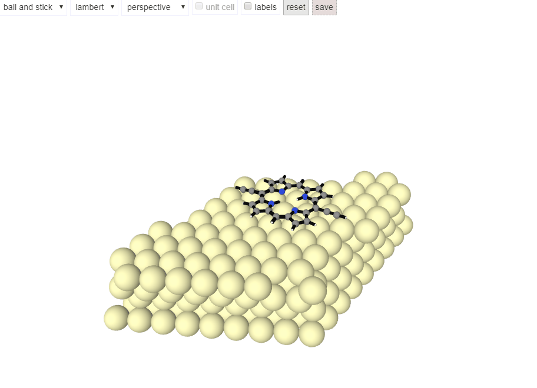

# ChemfilesViewer

[](https://alexriss.github.io/ChemfilesViewer.jl/stable)
[](https://alexriss.github.io/ChemfilesViewer.jl/dev)
[](https://github.com/alexriss/ChemfilesViewer.jl/actions)


A julia library to visualize chemical molecules and other structures in the [Chemfiles](https://github.com/chemfiles/Chemfiles.jl) format.

The structures can be rendered in [Jupyter](https://jupyter.org/) or in an external window (via [Blink](https://github.com/JuliaGizmos/Blink.jl)). [Pluto](https://github.com/fonsp/Pluto.jl) should work if [WebIO support](https://github.com/fonsp/Pluto.jl/pull/991) is implemented.

## Demo



## Usage

```julia
using ChemfilesViewer

# read molecule using Chemfiles
using Chemfiles
trajectory = Trajectory("mol.sdf")
mol = read(trajectory)

# render molecule
render_molecule(mol)
# render another molecule in the same window
render_molecule!(mol)

# save reference to last used output
viewer_id = get_current_chemviewer_id()
    
# change properties
d = generate_dict_molecule(mol)
d["atoms"][1]["color"] = "#f00000"
d["atoms"][1]["label"] = "Important atom"
d["atoms"][1]["radius"] = 1.0
render_dict_molecule(d, chemviewer_id=viewer_id)

# change view
set_camera_position!("x", "-")
set_options!(Dict("drawingType" => "wireframe"))
set_camera_position!("c", "+")
set_options!(Dict("drawingType" => "ball and stick"))

# change style
set_options!(Dict("styles" => Dict(
    "H" => Dict("color" => "#c0c0c0", "radius" => 0.4),
    "N" => Dict("color" => "#241571"),
    "bond" => Dict("color" => "#ffffff", "radius" => 0.3)
)))

# save image
save_image("test.png")
```

Use mouse to rotate, zoom and pan. Keyboard shortcuts `x`, `y`, `z` set the view along the x, y and z axis.
Analogously, `a`, `b`, `c` set the view along the unit cell vectors. Uppercase letters (`X`, `Y`, `Z`, `A`, `B`, `C`) set the opposite view direction.

## Notes

The javascript rendering is based on [Patrick Fuller's imolecule](https://github.com/patrickfuller/imolecule).